# CFGDegree
Repository containing CFG Summer Degree assignments.
## About me 🧜‍♀️
Hi, I'm Dea Satko, currently working as an Equity Analyst 📈 at a leading investment company in London. I am now looking to transition into a career in Tech 🖥️.

Originally from Italy 🍕, I've spent most of my life there before moving to London about eight years ago. I pursued both my Bachelor's and Master's degrees in Finance at Queen Mary University of London 👩‍🎓.

In my free time, I love playing video games 🎮 and attending music events 🎼.

 My favourite quote is:

> "Be yourself; everyone else is already taken." — Oscar Wilde

## Past Projects 📚
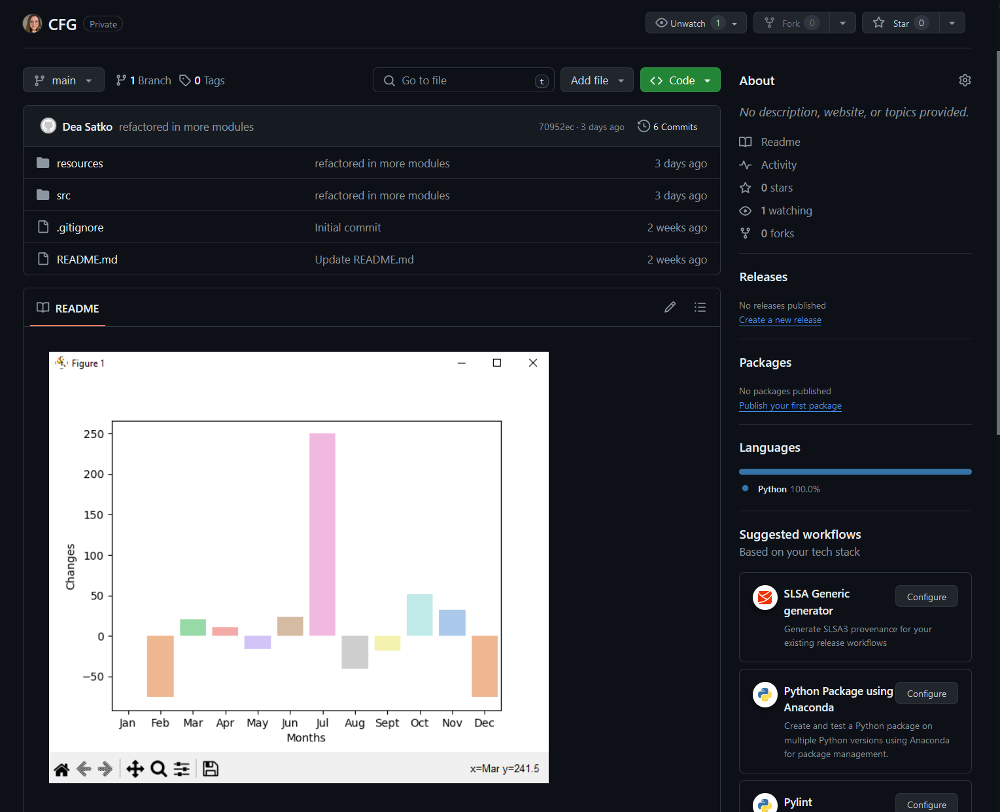

The project involved using Python for basic data analysis on a spreadsheet. We were provided with a base CSV file containing mock sales data, which we analysed to track changes. Ultimately, we created a bar plot to visualise the monthly sales trends for the year 2018.

*For more information please visit:* [Link](https://github.com/deasatko/CFG)

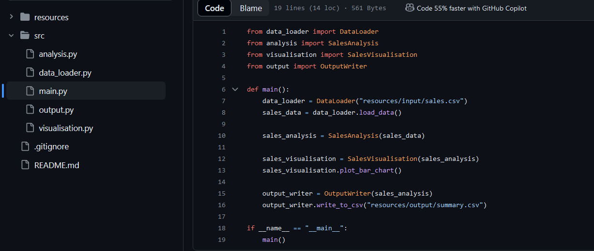

## CFG Summer Degree Assignments
I will be using this repository for all the assignments that will be due in this course.

### Git and GitHub
In this assignment I am required to show my understanding of Git and Github and I will be sharing screenshots of the various inputs I will use here.
My goals are:
- Using markdown text formatting features.
- Learn Git flow

### Question 1: Using Git and GitHub
Set up GitHub accounts for yourself and create a repository for you to work in. Demonstrate

Git and GitHub usage for collaborative projects using pull requests, reviews and more!
Make sure to add your assigned instructor as a collaborator to your individual repository for marking and review purposes.

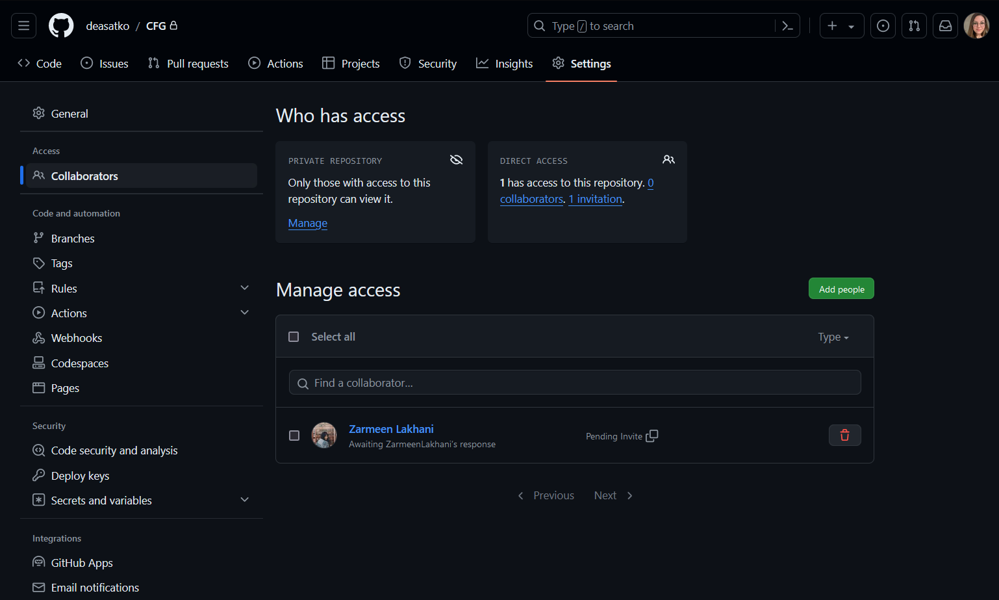

Marks:
A. Demonstration of setting up GitHub and use of README (14 marks)

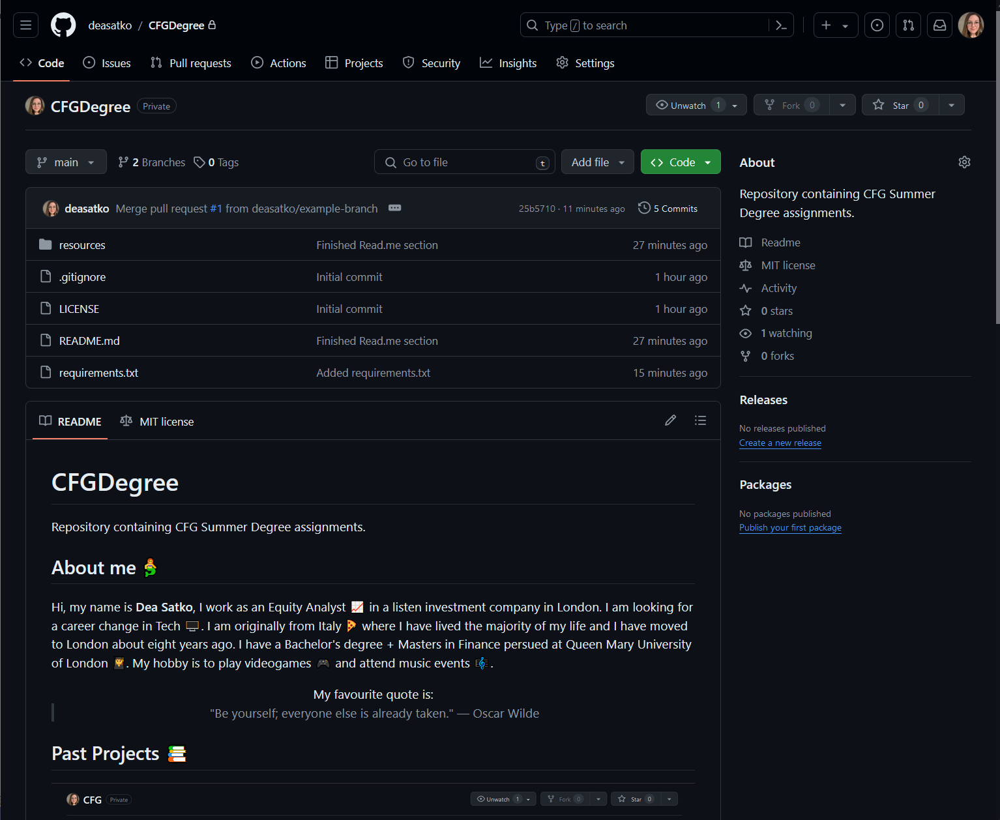

B. Knowledge and demonstrated use of GitHub commands (14 marks)
You should:
+ Create a GitHub account
+ Create a private repository for this assignment, this repository can be used for the rest of your CFGDegree assignments.
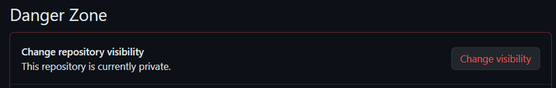

+ Create a README.md file that contains useful information about you, your previous CFGdegree projects, or what you’ll be using GitHub for in this assignment. *Please view README*
+ Use at least 6 different markdown text formatting features. See: Basic writing and formatting syntax: *Please view README*

+ With a file(s) of your choice, demonstrate the following:

1. Checking the status
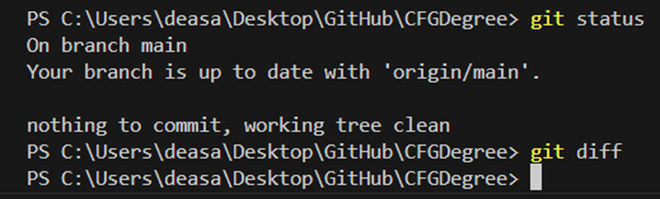
> 🗒️ **Note**: the command "git diff" shows us what was changed for each file comparing the local state to the remote state.

2. Creating a branch
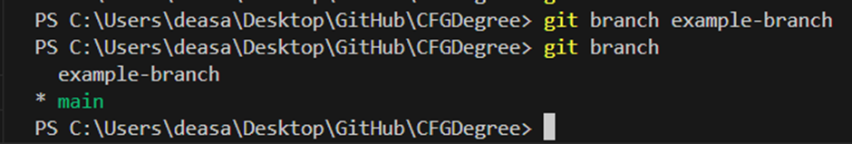

3. Adding files to a branch
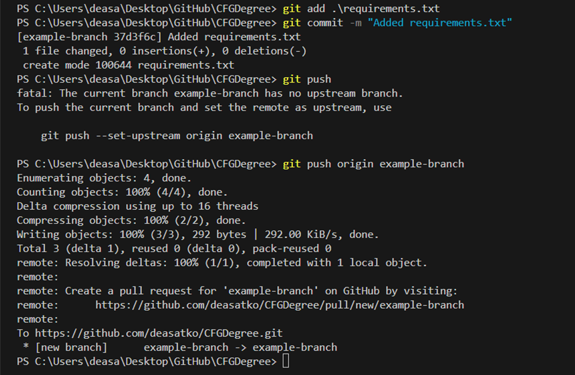
> 💡 **Tip**: If we use the command suggested by Git when pushing (git push --set-upstream origin example-branch), we can avoid to type "origin main" when pushing to the same branch in the future.

4. Adding commits with meaningful messages
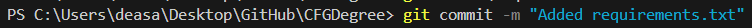

5. Opening a pull request
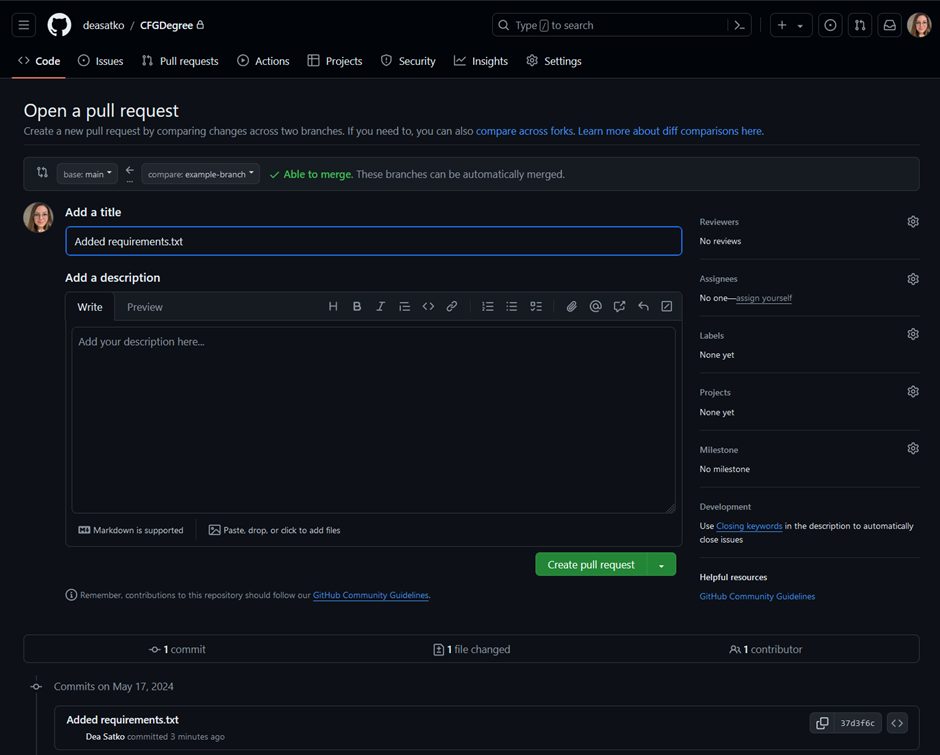

6. Merging and deploying to main branch
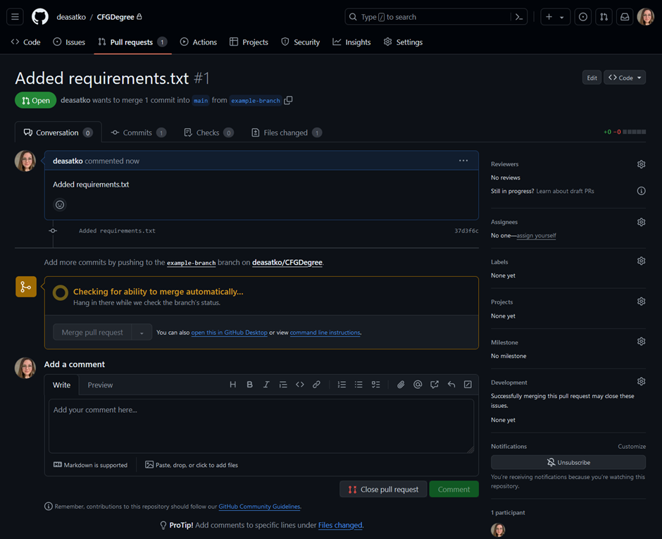
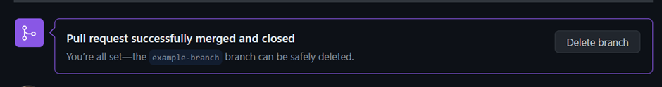
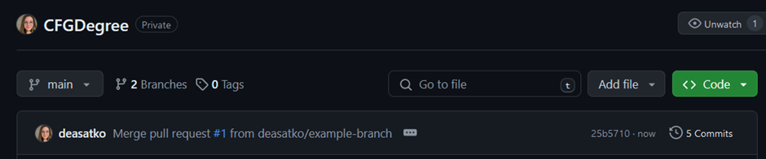

If needed, take screenshots of the process and add to your README file.
+ Create .gitignore (can be empty) and briefly explain what it is for:
*Git ignore is a file where we specify files and folders that we do not want to push in our repository. This is usually used for temporary files and the programming languages use when working with it.*

+ Create requirements.txt (can be empty) and briefly explain what it is for: *It is a file used to specify packages or libraries that will be used in the project and can be installed from the file. In most cases, this is found in Python projects.*