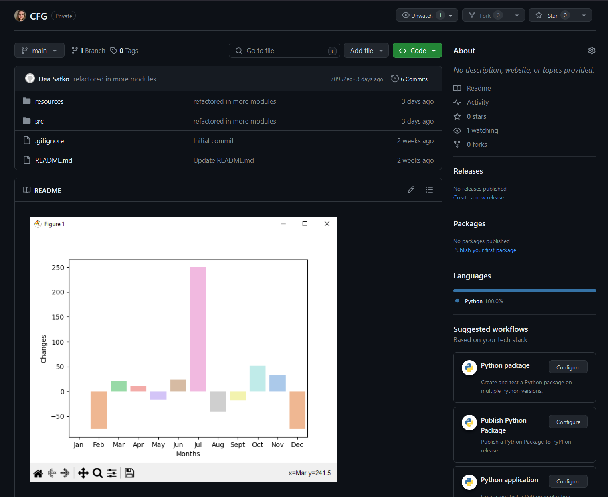

# CFGDegree
Repository containing CFG Summer Degree assignments.
## About me 🧜‍♀️
Hi, my name is **Dea Satko**, I work as an Equity Analyst 📈 in a listen investment company in London. I am looking for a career change in Tech 🖥️. I am originally from Italy 🍕 where I have lived the majority of my life and I have moved to London about eight years ago. I have a Bachelor's degree + Masters in Finance persued at Queen Mary University of London 👩‍🎓. My hobby is to play videogames 🎮 and attend music events 🎼. 

 My favourite quote is:

> "Be yourself; everyone else is already taken." — Oscar Wilde

## Past Projects 📚

The project consisted in using Python to do basic data analysis on a spreadsheet. A base csv file was shared containing fake sales data which has been used for analysis and finally creating a barplot to show the changes in sales each month of 2018.

*For more information please visit:* [Link](https://github.com/deasatko/CFG)

## CFG Summer Degree Assignments
I will be using this repository for all the assignments that will be due in this course.

### Git and GitHub
In this assignment I am required to show my understanding of Git and Github and I will be sharing screenshots of the various inputs I will use here.
My goals are:
- Using markdown text formatting features.
- Learn Git flow