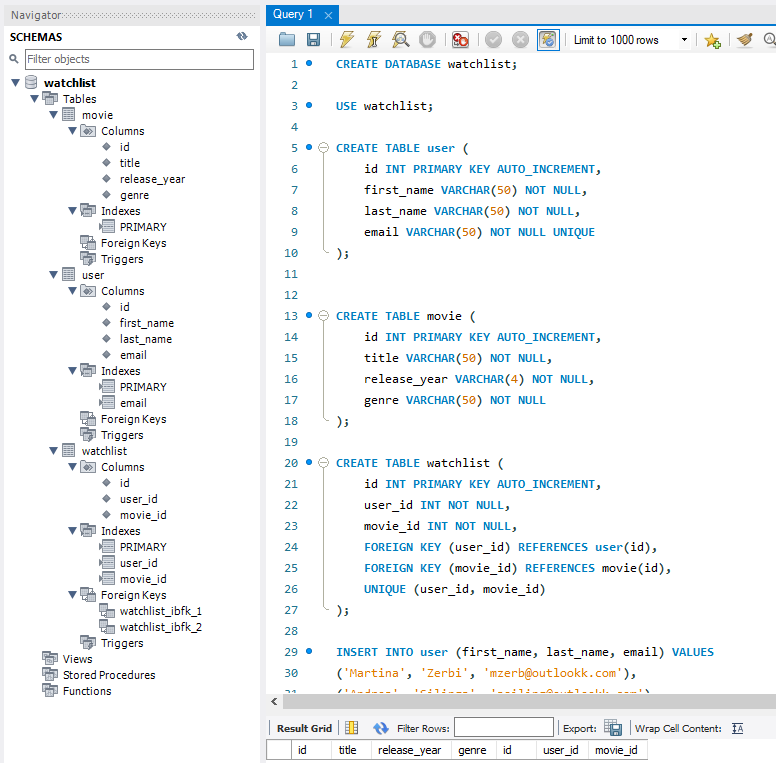

# Watchlist CLI

The Watchlist CLI is a command-line interface application designed to interact with a Flask-based API that manages user watchlists. It allows users to perform various actions such as fetching a user's watchlist, adding movies to the watchlist, and removing movies from the watchlist.

## Database design

Here we can find the initial step taken when designing the database using Excalidraw


## How to use the API with the CLI

First of all we need to create a `.env` where we need to fill it up with the database credentials like this:

```
USER_DB="root"
PASSWORD_DB="password"
HOST_DB="127.0.0.1"
DATABASE_NAME="watchlist"
```

We now need to create the database with MySQL Workbench and populate it with some relevant data.
The SQL code can be found in `watchlist.sql` at the root of this project.

This is how the schema should look like:


## Run the code

Now that we did setup everything, we firstly need to run the API on the background. Open a terminal, navigate to the project root and run the following command: `python -m flask run`


The following output is expected: `* Running on http://127.0.0.1:5000`

## Use the CLI

Now that our backend is running, we can use the terminal to interact with it through the CLI.

#### Actions

Here are the actions available in the Watchlist CLI:

1. **Fetch Hello World Message**
   - Command: `python watchlist_cli.py hello`
   - Description: Fetches a hello world message from the server.

2. **Check Server Health**
   - Command: `python watchlist_cli.py health`
   - Description: Checks the health status of the server.

3. **Fetch User's Watchlist**
   - Command: `python watchlist_cli.py watchlist --user_id <user_id>`
   - Description: Retrieves the watchlist for the specified user.

4. **Add Movie to Watchlist**
   - Command: `python watchlist_cli.py add --user_id <user_id> --movie_id <movie_id>`
   - Description: Adds a movie to the watchlist of the specified user.

5. **Remove Movie from Watchlist**
   - Command: `python watchlist_cli.py delete --user_id <user_id> --movie_id <movie_id>`
   - Description: Removes a movie from the watchlist of the specified user.

#### Usage

Since we did already populate the database with some data, we can have an example workflow as the following to test it out.

Open a new tab in the terminal and grab the watchlist for user number 1 with the following command:

`python main.py watchlist --user_id 1`

Now add a new movie into the user watchlist:

`python main.py add --user_id 1 --movie_id 2`

If we try to add the same movie, it will fail as it won't accept duplicates. We can now run the `watchlist` command to see that it has been added successfully.

Now try to delete it and run again the command to double check that it has been deleted.
`python main.py delete --user_id 1 --movie_id 2`

This is the whole workflow in a screenshot:
